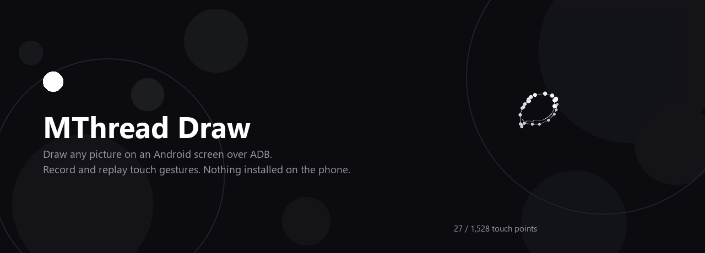
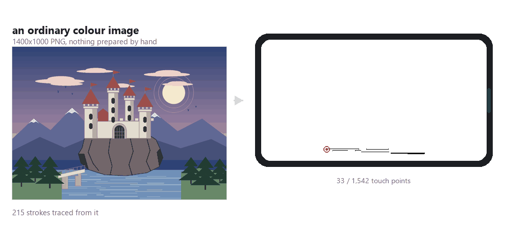
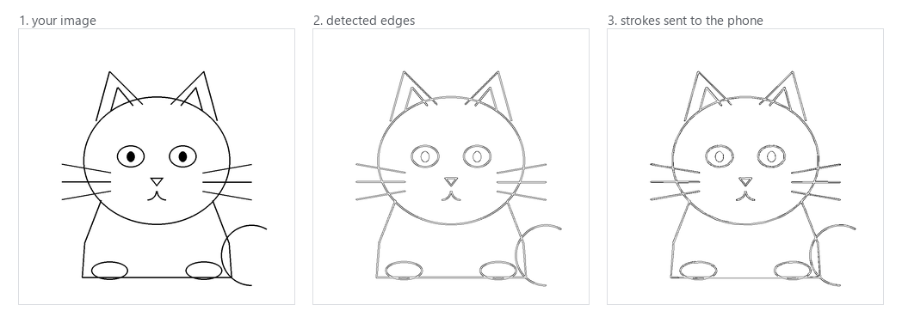
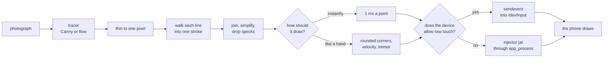
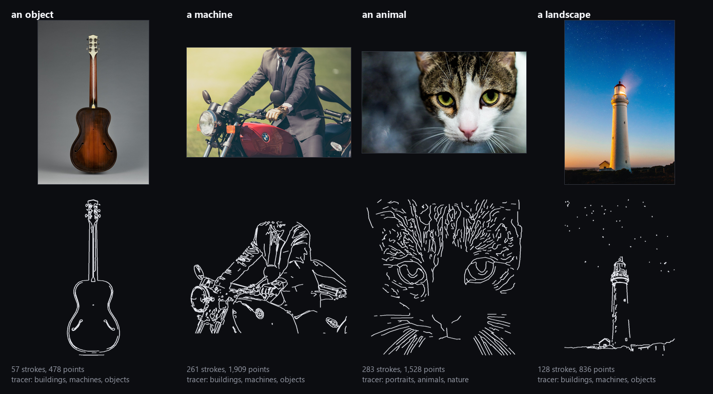

<p align="center">
  
</p>

<p align="center">
  <sub>Every white circle is one touch point, in the order it is sent to the phone. Nothing about that picture is illustrated:
  it is a real <a href="tools/make_banner.py"><code>tools/make_banner.py</code></a> run over <code>examples/cat.jpg</code>.</sub>
</p>

<p align="center">
  <a href="https://maxawer.github.io/MThread-Draw/"></a>
  <a href="https://github.com/MAXAWER/MThread-Draw/releases/latest"></a>
</p>

<p align="center">
  <a href="https://github.com/MAXAWER/MThread-Draw/actions/workflows/ci.yml"></a>
  <a href="https://github.com/MAXAWER/MThread-Draw/releases/latest"></a>
  <a href="https://github.com/MAXAWER/MThread-Draw/releases"></a>
  <a href="LICENSE"></a>
  
  
  <a href="https://github.com/MAXAWER/MThread-Draw/stargazers"></a>
</p>

<p align="center">
  
</p>

<p align="center">
  <sub>An ordinary photograph in, 57 strokes and 478 touch points out: the exact path list <code>mthread</code> sends to the device, in the order it draws them.<br>
  On a Pixel 8 Pro that draws in under two seconds. Rendered from a real run by <a href="tools/make_demo.py"><code>tools/make_demo.py</code></a>; playback speed here is arbitrary.</sub>
</p>

---

> ### Licence in one line
>
> **AGPL-3.0, with a commercial licence available.** Use it, change it, share
> it — but a version you distribute, or run as a service other people use, has
> to publish its source under the AGPL too. To put it inside a product whose
> source stays closed, [ask for a commercial licence](https://github.com/MAXAWER/MThread-Draw/issues).
> Full explanation, in English and Russian: **[TERMS.md](TERMS.md)**.
>
> **AGPL-3.0 плюс коммерческая лицензия.** Пользуйтесь, меняйте, делитесь — но
> распространяемая версия и сервис на её основе обязаны публиковать исходники
> под AGPL. Чтобы встроить в продукт с закрытым кодом, нужна коммерческая
> лицензия. Подробно: [TERMS.md](TERMS.md).

---

## Try it before you install it

**[maxawer.github.io/MThread-Draw](https://maxawer.github.io/MThread-Draw/)** puts
three of these drawings in your browser and asks you to trace one by hand. The
lines are not a mock-up: they are the exact strokes this program sends to a
phone, exported from a real run over the photographs in [`examples/`](examples/),
and the time to beat is the time the program takes.

A guitar is 294 points and lands in about a second. Tracing it yourself takes
most people twenty.

## Get it

| | |
|---|---|
| **Windows** | [**Download the installer**](https://github.com/MAXAWER/MThread-Draw/releases/latest) — `MThreadDraw-x.y.z-x64.msi`. Installs like any other program, Start Menu entry and uninstaller included. |
| **macOS** | [**Download the app**](https://github.com/MAXAWER/MThread-Draw/releases/latest) — `.dmg` for Apple Silicon or Intel. Drag it to Applications. |
| **Linux** | Run from source; three commands, [below](#from-source). |

**Nothing else to install.** Python, OpenCV and **adb** all travel inside the
application — no Android SDK, no platform-tools download, no `PATH` to edit.

The builds are not code-signed, because certificates cost money this project
does not take. Windows SmartScreen says "unknown publisher" once — *More info* →
*Run anyway*. macOS wants a right-click → **Open** on the first launch.

## Then, in three steps

1. **Turn on USB debugging** on the phone: Settings → About phone → tap *Build
   number* seven times → Developer options → *USB debugging*.
2. **Plug it in.** Or go wireless: `adb connect 192.168.1.42:5555`.
3. **Open MThread Draw** → *Connect device* → *Capture screen* → *Load image* → drag
   it over the phone preview → **START DRAWING**.

No GUI, no clicking:

```python
from mthread import Device
Device().draw_paths([[(100, 200), (400, 200), (400, 600)]])
```

---

## How an image becomes touches

<p align="center">
  
</p>

Feed it an ordinary photograph. A tracer decides where the lines are, the result
is thinned to one pixel of width, and each line is then walked into a single
stroke — not an outline *around* the line, which is what draws everything twice.
The picture above is `examples/guitar.jpg`, untouched: 57 strokes, 478 points.

There are two tracers, and the app picks between them by asking what is in the
picture rather than which algorithm you would like:

| What you say is in it | What runs | Why that one |
|---|---|---|
| **Buildings, machines, objects** | Canny edges, thinned, then walked into strokes | Keeps every bit of structure an edge detector sees — which is what a machine, a tower or a building is made of. |
| **Portraits, animals, nature** | Flow-based coherent lines, after Kang, Lee and Chui | Works out the direction each line runs in and filters along it. Calmer, longer strokes, and a face stays a face instead of becoming film grain. |

Neither wins everywhere, which is why both are still here. There is also an
opt-in third method, `method="neural"`, which asks a trained model which edges
matter; it needs a 46 MB download and a few seconds, and it is better than both
on some photographs and worse than both on grainy ones.

<details>
<summary><b>The whole path, from a JPEG to a finger on the glass</b></summary>



Every box is a module: `mthread.vectorize`, `mthread.trace`, `mthread.paths`,
`mthread.hand`, `mthread.injector`. The branch at the bottom is the one that
matters in practice — see [Why this exists](#why-this-exists).

</details>

### The same pipeline, four photographs

<p align="center">
  
</p>

Nothing was prepared, retouched or masked — these are the files in
[`examples/`](examples/), resized and otherwise untouched. The only thing that
differs between the columns is the two sliders every user has: the cat gets one
notch more *Detail*, and the lighthouse one notch less *Edge sensitivity*,
because it stands under a sky full of stars and every star is an edge.
`python tools/make_demo.py` reproduces the whole picture.

Colour is what gets lost: a finger draws one black line, so the output is always
a line drawing. Illustrations and line art come out closest to the original,
photographs come out as their edges — the *Edge sensitivity* and *Detail* sliders
decide how much detail survives, and an optional background remover (`rembg`)
helps with portraits and product shots.

---

## What it works with

| | |
|---|---|
| **Devices** | Any Android phone or tablet that `adb devices` lists — over USB, or wireless ADB (`adb connect <ip>:5555`). Root is not needed on most devices. |
| **Emulators** | Anything exposing an ADB port: Android Studio AVD, BlueStacks (`:5555`), LDPlayer (`:5555`), Nox (`:62001`), MEmu (`:21503`). Raw `/dev/input` support differs between builds — `mthread info` tells you in one line, and [device reports](https://github.com/MAXAWER/MThread-Draw/issues/new?template=device_report.md) are welcome. |
| **Image formats** | PNG, JPEG, BMP, WebP. Raster only for now; SVG input is [an open task](https://github.com/MAXAWER/MThread-Draw/issues). |
| **Host** | Windows, macOS, Linux. Python 3.9+. |

## What people use it for

- **Drawing games and canvases on the phone** — Gartic Phone, Skribbl.io, sketch
  chats, whiteboards, notes apps: anything where the picture has to be produced by
  an actual finger on the glass.
- **Signatures and stamps** you would otherwise redraw by hand every time.
- **QA and regression passes** — record a login flow once, replay it against every
  build, at 2x, ten times in a row.
- **Repetitive tapping** in apps that offer no other automation hook.

Whether automating a particular game is allowed is between you and that game's
rules; this is a general-purpose input tool.

---

## Why this exists

`adb shell input tap` spawns a process on the device for every single call. At
100–300 ms each, anything continuous — a gesture, a drawn line, a test script —
is unusably slow.

`mthread` writes raw kernel input events into `/dev/input` through **one** pushed
shell script instead. A stroke that takes 40 seconds through `input swipe`
finishes in well under a second. That single difference is what makes both
gesture replay and image drawing practical.

This repository is two things:

- **`mthread`** — a small Python library for fast synthetic touch input on Android
  over ADB. Records gestures, replays them, drives raw `/dev/input` events. Pure
  standard library; the core has no dependencies at all.
- **`MThread Draw`** — a desktop app built on it, for people who would rather click
  buttons than write code. There are two front ends: a portable one in Python
  that runs anywhere, and a native WinUI 3 one for Windows. Both drive the same
  engine over a pipe, so neither has its own idea of how anything works.

---

## Record and replay gestures

Press record, do something on the phone, press stop. You get a JSON file with
every touch event and its timing. Replay it whenever you want, at whatever speed.

```bash
mthread record -o login.json      # do the thing on the phone, press Enter
mthread play login.json --speed 2 --repeat 5
```

Useful for regression passes, for reproducing a bug reliably, or for any
repetitive tapping you would rather not do by hand.

<a name="from-source"></a>

## From source

[`run.bat`](run.bat) on Windows and [`run.sh`](run.sh) elsewhere do the whole
thing: virtual environment, dependencies, and `adb` if the machine has none.
Otherwise, by hand:

```bash
git clone https://github.com/MAXAWER/MThread-Draw.git
cd MThread-Draw

pip install -e .            # library only - no dependencies at all
pip install -e ".[draw]"    # + image vectorisation (OpenCV, NumPy, Pillow)
pip install -e ".[gui]"     # + the desktop app
pip install -e ".[bg]"      # + rembg background removal
```

`adb` is found in this order: `ADB_PATH`, the copy inside a packaged build, your
`PATH`, a `platform-tools` directory beside the working directory, then the usual
Android SDK locations. If you have none of those:

```bash
python tools/fetch_platform_tools.py     # ~7 MB, straight from Google
```

To build the packaged application and its installer yourself:

```bash
pip install pyinstaller
python tools/build_app.py --msi        # Windows, needs `dotnet tool install --global wix --version 5.0.2`
python tools/build_app.py --dmg        # macOS
```

## Command line

```bash
mthread devices                       # what is attached
mthread info                          # screen size and digitizer ranges
mthread record -o session.json        # record until Enter
mthread record -o session.json -d 30  # record for 30 seconds
mthread play session.json             # replay once
mthread play session.json --speed 0.5 --repeat 3
```

## Library

```python
from mthread import Device, Recorder, Session, replay

device = Device()
print(device.screen_size, device.touch_device.path)

recorder = Recorder(device)
recorder.start()
input("Do something on the phone, then press Enter...")
recorder.stop().save("flow.json")

replay(device, Session.load("flow.json"), speed=2.0, repeat=10)
```

---

## How it works

**Batched events.** Every stroke becomes a list of `sendevent` lines, written to a
temporary script, pushed once to `/data/local/tmp`, executed, and deleted. One ADB
round trip instead of thousands.

**Coordinate translation.** The touchscreen digitizer has its own coordinate
space, and on many phones it is *not* the display resolution — a 1080-pixel-wide
screen commonly sits on a 4096-step digitizer. Sending display pixels straight to
`sendevent` puts the touch in the wrong place. `mthread` reads the real axis
ranges from `getevent -pl` and rescales. Run `mthread info` to see yours.

**Three ways in, picked automatically.** Writing kernel events is fastest, but a
recent Android refuses it: SELinux denies the shell domain write access to
`/dev/input` however the file permissions read, so `sendevent` fails per line
while the script exits cleanly. Where that happens, `mthread` streams points to
a small injector it runs on the device instead - one process for a whole
drawing, with the wait between points under our control. Failing even that, it
shells out to `input` once per point, which needs nothing installed and costs
about 110 ms each. `mthread info` says which path your device gets.

**Drawing like a hand.** Timing is what gives a machine away, and the injector is
what makes timing ours to choose. `mthread.hand` rounds corners, varies pen
speed along a stroke, adds a slow tremor, overshoots stroke ends and reorders
strokes the way a person would; `Pacing` decides how long each point takes. Set
`human=0` and it draws as fast as the receiving app can sample - about 6 ms a
point, since anything faster arrives between frames and is never seen.

**Retrace removal.** `findContours` walks the *boundary* of a region, and Canny
turns one pen stroke into two parallel edges — so the naive path traces up one
side of every line and back down the other, drawing everything twice.
`dedupe_retrace` detects when a contour's two halves are the same stroke and keeps
one of them, while leaving genuine closed shapes like circles intact.

---

## Known limits

- **Recordings are not portable between phones.** They contain raw digitizer
  coordinates, so replaying a recording made on a different panel is refused
  rather than silently misfiring.
- **Rotation is not handled.** Record and replay in the same orientation.
- **Some devices expose no touchscreen usable by `sendevent`.** Drawing then fails
  with an explicit error instead of a wrong result; `Device.swipe()` still works,
  and an automatic fallback is an open task.
- **`mthread info` is the first thing to check** when touches land in the wrong
  place.

---

## Open ends

Contributions welcome — see [CONTRIBUTING.md](CONTRIBUTING.md). Issues labelled
[`good first issue`](https://github.com/MAXAWER/MThread-Draw/labels/good%20first%20issue)
are the easiest way in. Things worth doing:

- SVG input, so line art skips edge detection entirely.
- Auto-detect swapped X/Y axes (the `swap_xy` flag exists but nothing sets it).
- Rotation-aware coordinate mapping.
- An automatic `input swipe` fallback when raw touch is unavailable.
- Trim recordings visually in the app; cut dead time at the start and end.
- Assertions during replay — wait for a screenshot to match before continuing,
  which is what turns this into a real test runner.
- Skeletonise edges instead of halving contours, for cleaner line art.
- Pressure-sensitive strokes from image darkness.

---

## If something does not work

Open an issue — there are templates for
[bugs](https://github.com/MAXAWER/MThread-Draw/issues/new?template=bug_report.md)
and for [device reports](https://github.com/MAXAWER/MThread-Draw/issues/new?template=device_report.md).
Touches landing in the wrong place, a phone that refuses to connect, an emulator
behaving differently — paste the output of `mthread info` and it is usually a
short fix. Digitizer ranges differ wildly between panels, and only what people
report can be handled.

**If this saved you an afternoon, a ⭐ costs nothing and is how anyone else finds
it.**

## Licence

**AGPL-3.0** — see [LICENSE](LICENSE). A **commercial licence** is available from
the author for use in products that will not publish their source. Both are
explained in plain English and Russian in **[TERMS.md](TERMS.md)**.

---

<details>
<summary><b>По-русски</b></summary>

## Что это

Инструмент, который **рисует картинки на экране Android** и **записывает и
повторяет жесты** — по USB или беспроводному ADB, без установки чего-либо на сам
телефон.

Две части в одном репозитории:

- **`mthread`** — библиотека для быстрого синтетического ввода касаний на Android
  через ADB. Записывает жесты, воспроизводит их, работает с событиями
  `/dev/input` напрямую. Ядро не требует зависимостей.
- **`MThread Draw`** — десктопное приложение поверх неё, для тех, кто предпочитает
  кнопки коду.

## Установка

| | |
|---|---|
| **Windows** | [**Скачать установщик**](https://github.com/MAXAWER/MThread-Draw/releases/latest) — `MThreadDraw-x.y.z-x64.msi`. Ставится как обычная программа, с ярлыком в меню «Пуск» и деинсталлятором. |
| **macOS** | [**Скачать приложение**](https://github.com/MAXAWER/MThread-Draw/releases/latest) — `.dmg` для Apple Silicon или Intel, перетащить в Applications. |
| **Linux** | Из исходников, три команды — [ниже](#из-исходников). |

**Больше ничего ставить не нужно.** Python, OpenCV и **adb** лежат внутри самого
приложения: ни Android SDK, ни platform-tools скачивать не придётся, `PATH`
трогать тоже.

Сборки не подписаны — сертификаты стоят денег, которых у проекта нет. Windows
один раз скажет «неизвестный издатель»: *Подробнее* → *Выполнить в любом случае*.
На macOS первый запуск — правой кнопкой → **Открыть**.

## Дальше три шага

1. **Включить отладку по USB**: Настройки → О телефоне → семь раз по «Номер
   сборки» → Для разработчиков → Отладка по USB.
2. **Подключить телефон.** Или по Wi-Fi: `adb connect 192.168.1.42:5555`.
3. **Открыть MThread Draw** → *Connect device* → *Capture screen* → *Load image* →
   перетащить картинку на превью экрана → **START DRAWING**.

<a name="из-исходников"></a>

### Из исходников

```bash
git clone https://github.com/MAXAWER/MThread-Draw.git
cd MThread-Draw
pip install -e ".[gui]"
mthread_draw
```

Проще запустить [`run.bat`](run.bat) на Windows или [`run.sh`](run.sh) на macOS и
Linux — они сами создадут виртуальное окружение, поставят зависимости и скачают
`adb`, если своего на машине нет.

`adb` ищется по порядку: `ADB_PATH`, копия внутри собранного приложения, ваш
`PATH`, папка `platform-tools` рядом с рабочим каталогом, затем обычные пути
Android SDK. Если ничего из этого нет:

```bash
python tools/fetch_platform_tools.py     # ~7 МБ, прямо от Google
```

## Как картинка превращается в касания

Подаёте обычную фотографию, готовить её заранее не нужно. Трассировщик находит
линии, результат утончается до одного пикселя, и каждая линия проходится одним
штрихом — не обводится по контуру, иначе всё рисовалось бы дважды. Гитара выше
это `examples/guitar.jpg` без единой правки: 57 штрихов, 478 точек.

Трассировщика два, и приложение спрашивает не про алгоритм, а про то, что на
фотографии:

| Что на фотографии | Что работает | Почему именно это |
|---|---|---|
| **Здания, техника, объекты** | Границы по Кэнни, утончение, обход в штрихи | Сохраняет всю структуру, которую видит детектор границ, — а машина или башня из неё и состоит. |
| **Портреты, животные, природа** | Когерентные линии по направлению потока | Считает, куда идёт каждая линия, и фильтрует вдоль неё: штрихи длиннее и спокойнее, лицо остаётся лицом, а не зерном плёнки. |

Ни один не выигрывает везде — поэтому остались оба. Есть и третий, по желанию:
`method="neural"` спрашивает у обученной модели, какие границы важны; ему нужны
46 МБ модели и несколько секунд.

<p align="center">
  
</p>

Ничего не готовилось и не ретушировалось: это файлы из [`examples/`](examples/),
только уменьшенные. Между колонками отличаются лишь те два ползунка, что есть у
любого пользователя: коту добавлена одна ступень *Detail*, маяку убрана одна
ступень *Edge sensitivity* — он стоит под звёздным небом, а каждая звезда это
граница. Всю картинку целиком собирает `python tools/make_demo.py`.

Теряется цвет: палец рисует одну чёрную линию, поэтому результат всегда штриховой.
Ближе всего к оригиналу выходят иллюстрации и контурные рисунки, из фотографии
получатся её границы. Ползунки *Edge sensitivity* и *Detail* решают, сколько
деталей останется, а опциональное удаление фона (`rembg`) помогает с портретами и
предметной съёмкой.

## С чем работает

| | |
|---|---|
| **Устройства** | Любой телефон или планшет, который виден в `adb devices` — по USB или по Wi-Fi (`adb connect <ip>:5555`). На большинстве устройств root не нужен. |
| **Эмуляторы** | Всё, что открывает порт ADB: Android Studio AVD, BlueStacks (`:5555`), LDPlayer (`:5555`), Nox (`:62001`), MEmu (`:21503`). Поддержка сырого `/dev/input` отличается от сборки к сборке — `mthread info` покажет за одну строку. Отчёты о конкретных устройствах приветствуются. |
| **Форматы** | PNG, JPEG, BMP, WebP. Пока только растр; SVG — в списке задач. |
| **Хост** | Windows, macOS, Linux. Python 3.9+. |

## Зачем это нужно

`adb shell input tap` запускает отдельный процесс на устройстве при каждом
вызове — 100–300 мс на команду. Для чего-либо непрерывного это неприемлемо
медленно. `mthread` пишет события ядра напрямую через **один** сценарий,
загруженный на устройство. Штрих, который через `input swipe` рисуется 40 секунд,
здесь занимает меньше секунды.

## Что с этим делают

- **Рисовалки на телефоне** — Gartic Phone, Skribbl.io, скетч-чаты, заметки и
  доски: всё, где картинку нужно вывести пальцем по стеклу.
- **Подписи и штампы**, которые иначе приходится перерисовывать вручную.
- **Тестирование**: записали сценарий логина один раз — прогоняете на каждой
  сборке, на удвоенной скорости, десять раз подряд.
- **Однообразные нажатия** в приложениях, где других способов автоматизации нет.

Допустимо ли автоматизировать конкретную игру — вопрос её правил; это инструмент
ввода общего назначения.

## Командная строка

```bash
mthread devices                  # какие устройства подключены
mthread info                     # разрешение экрана и диапазоны тачскрина
mthread record -o session.json   # запись до нажатия Enter
mthread play session.json --speed 2 --repeat 5
```

Если `adb` установлен в нестандартное место — укажите путь в переменной
окружения `ADB_PATH`.

## Ограничения

- Записи **не переносятся между разными телефонами** — внутри сырые координаты
  тачскрина. Попытка воспроизвести запись на панели другого размера будет
  отклонена, а не выполнена криво.
- Поворот экрана не учитывается: записывайте и воспроизводите в одной ориентации.
- На части устройств тачскрин недоступен для `sendevent`. Тогда рисование
  завершится понятной ошибкой, а не кривым результатом; `Device.swipe()`
  продолжает работать, автоматический откат — в списке задач.
- Если касания попадают не туда — начните с `mthread info`.

## Если что-то не работает

Заведите issue — есть шаблоны для
[багов](https://github.com/MAXAWER/MThread-Draw/issues/new?template=bug_report.md)
и для [отчётов об устройстве](https://github.com/MAXAWER/MThread-Draw/issues/new?template=device_report.md).
Касания не туда, телефон не подключается, эмулятор ведёт себя иначе — приложите
вывод `mthread info`, обычно это чинится быстро. Диапазоны координат тачскрина у
разных панелей разные, и починить можно только то, что видно.

**Если инструмент сэкономил вам вечер — звезда ⭐ ничего не стоит, а найти проект
другим людям помогает.**

</details>
