<div align="center">

<a href="https://maxawer.github.io/MThread-Draw/">
  
</a>

<sub>Рисунок выше рисует себя сам, и это не иллюстрация: это те самые 232 штриха, которые<br>
<a href="tools/make_hero.py"><code>tools/make_hero.py</code></a> получает из <code>examples/motorcycle.jpg</code> — в том порядке, в котором программа отправляет их на телефон.</sub>

<br><br>

<a href="https://github.com/MAXAWER/MThread-Draw/releases/latest"></a>
<a href="https://github.com/MAXAWER/MThread-Draw/releases/latest"></a>
<a href="https://maxawer.github.io/MThread-Draw/"></a>

<br>

<a href="https://github.com/MAXAWER/MThread-Draw/actions/workflows/ci.yml"></a>
<a href="https://github.com/MAXAWER/MThread-Draw/releases/latest"></a>
<a href="LICENSE"></a>

<a href="README.md"></a>

<br><br>

### Рисует картинки на экране Android, касаясь его,<br>записывает и повторяет жесты. На телефон ничего не ставится.

<sub><b>USB или ADB по Wi-Fi · на большинстве устройств без root · без Android SDK · одна загрузка, всё внутри</b></sub>

<br>


<sub>На входе фотография, на выходе 57 штрихов и 478 точек касания — ровно тот список путей, что уходит на устройство.<br>
На Pixel 8 Pro это рисуется меньше чем за две секунды.</sub>

</div>

---

## Примерно за минуту

|  |  |
|---|---|
| **1 · Установить** | [**Windows**](https://github.com/MAXAWER/MThread-Draw/releases/latest) — `MThreadDraw-x.y.z-x64.msi`, с ярлыком в «Пуске» и деинсталлятором. [**macOS**](https://github.com/MAXAWER/MThread-Draw/releases/latest) — `.dmg` для Apple Silicon или Intel, перетащить в Applications. **Linux** — командная строка, [из исходников](#из-исходников). |
| **2 · Разбудить телефон** | Настройки → О телефоне → семь раз по «Номер сборки» → Для разработчиков → **Отладка по USB**. Подключить кабель или `adb connect 192.168.1.42:5555`. |
| **3 · Рисовать** | Телефон находится сам, экран показывается живьём, рисунок ложится поверх того места, куда попадёт. Тащить мышью, колесо — размер, Shift с колесом — поворот, затем **START DRAWING**. |

**Больше ничего ставить не нужно.** Python, OpenCV и **adb** лежат внутри самого
приложения. Оба окна нативные — **WinUI 3** на Windows и **SwiftUI** на macOS — и
оба разговаривают с одним и тем же движком по каналу, так что у них не может
быть разных представлений о происходящем. Сборки не подписаны: Windows один раз
скажет «неизвестный издатель», а macOS попросит первый запуск через правую
кнопку → **Открыть**.

---

## Что можно сделать в окне

|  |  |
|---|---|
| **Разместить точно** | Перетаскивание по живому экрану; колесо — размер, Shift с колесом — поворот, `Flip` — отражение, `Fit` — вписать заново. Положение хранится в долях экрана и переживает поворот телефона. |
| **Слои** | Несколько картинок друг относительно друга, у каждой своё положение и свои настройки трассировки. Слой можно спрятать, переставить, удалить. |
| **Ластик по штрихам** | Включить ластик и провести по ненужным линиям; `Undo erase` возвращает их. |
| **Пересчёт на месте** | Ползунок детализации перетрассирует уже загруженное — открывать файл заново не нужно. |
| **Запись и повтор** | Нажать запись, поделать что-нибудь на телефоне, остановить. Файл хранит доли экрана, поэтому **воспроизводится на другом телефоне**, с любой скоростью и сколько угодно раз. |
| **Нет живого экрана?** | Если захват не работает, подойдёт снимок, снятый на телефоне вручную: он не обновляется, но его пропорции — это то, что нужно для размещения. |

Ничего не готовя — из командной строки или из кода:

```bash
mthread shape heart               # сердце, вписанное в экран
mthread text "привет" --y 0.35    # текст любым шрифтом, что есть в системе
mthread record -o login.json      # затем: mthread play login.json --speed 2
```

```python
from mthread import Device
Device().draw_paths([[(100, 200), (400, 200), (400, 600)]])
```

---

## Как фотография превращается в касания

<div align="center">

</div>

Трассировщик находит линии, результат утончается до одного пикселя, и каждая
линия проходится одним штрихом — не обводится по контуру, иначе всё рисовалось бы
дважды. Выше — `examples/guitar.jpg` без единой правки: 57 штрихов, 478 точек.

Приложение спрашивает не про алгоритм, а про то, что на фотографии:

| Что на фотографии | Что работает | Почему именно это |
|---|---|---|
| **Здания, техника, объекты** | Границы по Кэнни, утончение, обход в штрихи | Сохраняет всю структуру, которую видит детектор границ, — а машина или башня из неё и состоит. |
| **Портреты, животные, природа** | Когерентные линии по направлению потока | Считает, куда идёт каждая линия, и фильтрует вдоль неё: штрихи длиннее и спокойнее, лицо остаётся лицом, а не зерном плёнки. |

Ни один не выигрывает везде — поэтому остались оба. Теряется цвет: палец рисует
одну чёрную линию, поэтому результат всегда штриховой.

<div align="center">


<sub>Ничего не готовилось и не ретушировалось — это файлы из <a href="examples/"><code>examples/</code></a>, только уменьшенные.<br>
Между колонками отличаются лишь те два ползунка, что есть у любого пользователя.</sub>
</div>

---

## Зачем это нужно

`adb shell input tap` запускает отдельный процесс на устройстве при каждом
вызове — 100–300 мс на команду, и для чего-либо непрерывного это неприемлемо
медленно. `mthread` отправляет весь рисунок на устройство целиком: события ядра
одним загруженным сценарием там, где телефон это позволяет, и инжектор на 3 КБ
через `app_process` там, где нет. Штрих, который через `input swipe` рисуется
40 секунд, здесь занимает меньше секунды.

Две части, и любая работает без другой: **`mthread`** — библиотека
синтетического ввода касаний, ядру которой не нужно вообще никаких зависимостей,
и **MThread Draw** — приложение поверх неё.

**[Как это устроено, подробно →](docs/INTERNALS.md)** (по-английски) — своя
система координат у тачскрина, три пути внутрь устройства и почему свежий Pixel
отказывает в самом быстром, чего стоит «мгновенно» и как это рисует по-человечески.

---

## С чем работает

|  |  |
|---|---|
| **Устройства** | Всё, что видно в `adb devices` — по USB или по Wi-Fi. На большинстве устройств root не нужен. |
| **Эмуляторы** | Android Studio AVD, BlueStacks (`:5555`), LDPlayer (`:5555`), Nox (`:62001`), MEmu (`:21503`). Поддержка сырого `/dev/input` отличается от сборки к сборке — `mthread info` покажет за одну строку. |
| **Картинки** | PNG, JPEG, BMP, WebP. Пока только растр. |
| **Хост** | Windows, macOS, Linux. Python 3.9+. |

Используют для рисовалок и досок на телефоне, подписей и штампов, тестовых
прогонов, где записанный сценарий повторяют на каждой сборке, и однообразных
нажатий там, где других способов автоматизации нет. Допустимо ли автоматизировать
конкретную игру — вопрос её правил; это инструмент ввода общего назначения.

<a name="из-исходников"></a>
<details>
<summary><b>Из исходников</b> и как собрать приложения самому</summary>

<br>

[`run.bat`](run.bat) на Windows и [`run.sh`](run.sh) на macOS и Linux делают всё
сами: окружение, зависимости и `adb`, если своего нет. Иначе вручную:

```bash
git clone https://github.com/MAXAWER/MThread-Draw.git
cd MThread-Draw

pip install -e .            # только библиотека - зависимостей нет вообще
pip install -e ".[draw]"    # + трассировка картинок (OpenCV, NumPy, Pillow)
pip install -e ".[bg]"      # + удаление фона (rembg)
```

`adb` ищется по порядку: `ADB_PATH`, копия внутри собранного приложения, ваш
`PATH`, папка `platform-tools` рядом с рабочим каталогом, затем обычные пути
Android SDK. Если ничего из этого нет, `python tools/fetch_platform_tools.py`
скачает его — 7 МБ, прямо от Google.

```bash
pip install pyinstaller
python tools/build_app.py --msi     # Windows: движок, интерфейс WinUI, установщик
python tools/build_macos.py --dmg   # macOS: бандл и образ диска
```

Установщику нужен WiX: `dotnet tool install --global wix --version 5.0.2`.

</details>

<details>
<summary><b>Командная строка</b> — все команды и общие параметры</summary>

<br>

```bash
mthread devices                  # какие устройства подключены
mthread info                     # разрешение экрана и диапазоны тачскрина

mthread shape heart              # heart, star, circle, square, polygon, spiral, wave
mthread shape star --points 7 --rotate 20
mthread text "привет"            # текст любым шрифтом, что есть в системе
mthread text "подпись" --font arial.ttf --scale 0.5 --y 0.8

mthread record -o session.json   # запись до нажатия Enter
mthread play session.json --speed 2 --repeat 5
```

У всех команд рисования одни и те же параметры размещения — `--scale`,
`--rotate`, `--flip-x`, `--flip-y`, `--x`, `--y`, `--margin` — и
`--speed`/`--human`, отвечающие за то, как рисовать.

Текст рисуется настоящим шрифтом и затем трассируется — поэтому доступен любой
шрифт системы, и поэтому буквы выходят контурами: залитая глифа это фигура с
внутренней и внешней границей, а здесь рисует один палец.

</details>

<details>
<summary><b>Библиотека</b> — весь интерфейс в десяти строках</summary>

<br>

```python
from mthread import Device, Recorder, Session, replay

device = Device()
print(device.screen_size, device.touch_device.path)

recorder = Recorder(device)
recorder.start()
input("Сделайте что-нибудь на телефоне и нажмите Enter...")
recorder.stop().save("flow.json")

replay(device, Session.load("flow.json"), speed=2.0, repeat=10)
```

</details>

<details>
<summary><b>Ограничения</b>, честно</summary>

<br>

- **Запись не знает, как был повёрнут телефон.** Рисование ориентацию учитывает,
  а запись хранит доли того экрана, на котором сделана, поэтому портретная
  запись в горизонтальной ориентации ляжет набок.
- **У воспроизведения есть постоянная накладная стоимость** — секунда-две на
  запуск и остановку инжектора. Штрихи и паузы точны, общая длительность нет.
- **Стоп не мгновенный.** Он отменяет то, что ещё не отправлено, а устройство
  дорисовывает уже полученное — около двух секунд.
- **Записи старше 1.2 не переносятся** между телефонами и честно об этом
  сообщают, а не рисуют мимо.
- **Начинайте с `mthread info`**, если касания попадают не туда.

</details>

---

## Помощь и участие

Что-то не работает — заведите issue, есть шаблоны для
[багов](https://github.com/MAXAWER/MThread-Draw/issues/new?template=bug_report.md)
и [отчётов об устройстве](https://github.com/MAXAWER/MThread-Draw/issues/new?template=device_report.md).
Приложите вывод `mthread info`: диапазоны координат тачскрина у разных панелей
разные, и починить можно только то, что видно.

Участие приветствуется — [CONTRIBUTING.md](CONTRIBUTING.md), а метка
[`good first issue`](https://github.com/MAXAWER/MThread-Draw/labels/good%20first%20issue)
самый простой вход.

## Лицензия

**AGPL-3.0 плюс коммерческая лицензия от автора.** Пользуйтесь, меняйте,
делитесь, бесплатно — но распространяемая версия и сервис на её основе обязаны
опубликовать полный исходный код под AGPL, включая перекрашенную копию. Чтобы
встроить в продукт с закрытым кодом, нужна
[коммерческая лицензия](https://github.com/MAXAWER/MThread-Draw/issues/new?title=Licence%20request).

Юридический текст: [LICENSE](LICENSE). Человеческим языком, по-русски и
по-английски: **[TERMS.md](TERMS.md)**.

<div align="center">
<br>
<b>Если инструмент сэкономил вам вечер — звезда ⭐ ничего не стоит, а найти проект другим людям помогает.</b>
</div>
