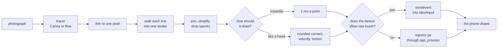

# How it works

The parts that are not obvious from the code, and the measurements that decided
them. The [README](../README.md) says what the program does; this says why it
does it that way.

## From a JPEG to a finger on the glass

Every box is a module: `mthread.vectorize`, `mthread.trace`, `mthread.paths`,
`mthread.hand`, `mthread.injector`. The branch at the bottom is the one that
matters in practice.

## The touchscreen has its own coordinate space

On many phones it is *not* the display resolution: a 1080-pixel-wide screen
commonly sits on a 4096-step digitizer. Sending display pixels straight to
`sendevent` puts the touch somewhere else entirely. `mthread` reads the real axis
ranges out of `getevent -pl` and rescales. `mthread info` prints yours, and it is
the first thing to look at when touches land in the wrong place.

## Three ways into a device, picked automatically

`Device.draw_paths` chooses; `mthread info` says which one this device gets.

| | | |
|---|---|---|
| **`raw`** | `sendevent` into `/dev/input` | Fastest, and refused by any recent Pixel. SELinux denies the shell domain write access whatever the file mode says, and `sendevent` then fails per line while the script exits cleanly — so it looks like it worked. `Device.supports_raw_touch` probes for it rather than trusting the permissions. |
| **`injector`** | A 3 KB jar run once through `app_process`, fed points over stdin | Works everywhere, and it is the only path where the time between points is ours. That is what makes both instant drawing and hand-like drawing possible. Built by `tools/build_injector.py`. |
| **`input`** | `input motionevent`, one process per point | About 110 ms each. The last resort, and it needs nothing installed. |

Two things about the injector that are easy to break:

- Events sharing a millisecond get coalesced, so it forces event time forward
  for every event.
- The host loop is bounded by a look-ahead. The injector sleeps on the device,
  so an unbounded loop queues the whole drawing in one breath and **Stop** has
  nothing left to cancel.

## "Instant" is not zero delay

The receiving app samples input once a frame, so a stroke delivered in under a
millisecond arrives as a press and a release with nothing in between. Measured
on a Pixel 8 Pro against a 1,679-point drawing:

| Delay between points | What arrived |
|---|---|
| 0 ms | Two thirds of the points lost |
| **1 ms** | **All of them, in 5.0 seconds** |
| 6 ms | All of them, in 19 seconds |

1 ms is the default for that reason.

## Drawing like a hand

Timing is what gives a machine away, and the injector is what makes timing ours
to choose. `mthread.hand` rounds corners, varies pen speed along a stroke, adds a
slow tremor, overshoots stroke ends and reorders strokes the way a person would.
`Pacing` decides how long each point takes; `human=0` skips all of it.

## Retrace removal

`findContours` walks the *boundary* of a region, and Canny turns one pen stroke
into two parallel edges — so the naive path traces up one side of every line and
back down the other, drawing everything twice. `dedupe_retrace` detects when a
contour's two halves are the same stroke and keeps one of them, while leaving
genuine closed shapes like circles intact.

## Recordings

`mthread.gestures` decodes raw touch events into strokes of `(time, x, y)` with
the coordinates as fractions of the screen, so `Device.play_gestures` can scale
them to whatever screen it is given.

The old format stored digitizer coordinates, which is why replaying one
elsewhere was refused: a digitizer's range has little to do with any display.
Nor could it be replayed on a *current* phone at all, since it went through
`/dev/input`. Playback now goes through the injector, like drawing.

Two things had to be learned to record anything at all:

- `adb shell` needs **two** `-t` flags to force a pty. Without one, libc buffers
  `getevent` output at 4 KB and a short recording produces nothing. A single
  `-t` is refused when stdin is not a terminal.
- The recorder listens to **every** input device by default. The node Android
  calls the touchscreen is not always the one touches arrive on.

## Screen mirroring

`mthread.mirror` drives a small on-device class over `adb shell -T` and reads
base64 frames. Not `exec-out`, which has no stdin; not a plain `shell`, whose
pty expands `\n` to `\r\n` and corrupts every frame after the first.

## Open ends

Contributions welcome — see [CONTRIBUTING.md](../CONTRIBUTING.md). Issues
labelled [`good first issue`](https://github.com/MAXAWER/MThread-Draw/labels/good%20first%20issue)
are the easiest way in.

- SVG input, so line art skips edge detection entirely.
- Auto-detect swapped X/Y axes: the `swap_xy` flag exists but nothing sets it.
- Rotation in recordings: store which way up the phone was and turn a replay to
  match. Drawing already follows the orientation; replay does not.
- Take the fixed second or two out of replay by keeping the injector alive
  between runs.
- Trim recordings visually in the app; cut dead time at the start and end.
- Assertions during replay — wait for a screenshot to match before continuing,
  which is what turns this into a real test runner.
- Pressure-sensitive strokes from image darkness.
- Shed OpenCV. Five of its functions are used and it is half the download.

## See also

- [RELEASING.md](RELEASING.md) — how a tag becomes an installer, and what each
  front end needs to build.
- [DEMO.md](DEMO.md) — how the pictures in the README are generated.
